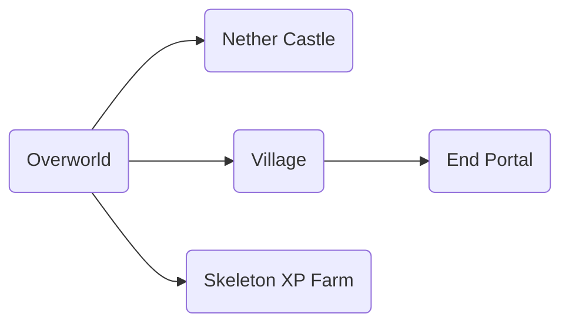

# A minecraft hardcore world which will be updated once I update it.
Playing @ 1.14.3 version right now

# Features (things built already)

## Nether map:

## Various accomplishments:

- Ender Dragon killed
- God Armor 3/4 pieces (**from 1.13 version**). Boots accidentally fell into lava (RIP)
- Elytra acquired

## Cosmetics:

- Railway through the frequently walked places in overworld
- Map (outdated)
- Giant statue of a mermaid / woman
- Mob zoo
- Memory corner
- Village (accessed through Nether)

## Useful:

- AUTOMATIC Item sorter
- AUTOMATIC Item smelter
- Elevators most of the places where I needed them

## Farms:

- AUTOMATIC Cobblestone TNT duper farm
- AUTOMATIC Creeper gunpowder farm
- AUTOMATIC Sugarcane farm
- AUTOMATIC Chicken cooker
- Carrots
- Skeleton XP farm
- Sheep (lots of colours)
- Pigs 
- Chicken
- Cows
- Nether warts
- Wheat
- Llamas
